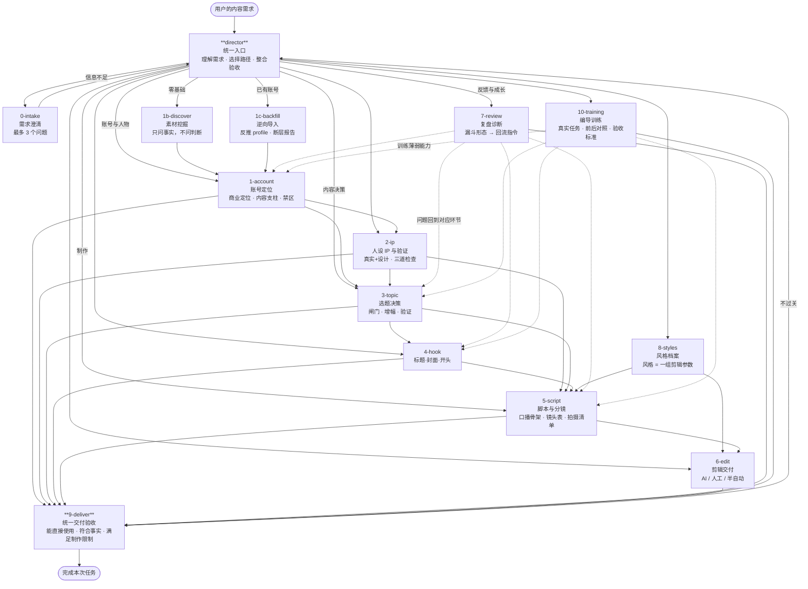

# 架构

## 一、这是一张网，不是一条线

统一入口直达任何环节；环节之间可横向跳转；三种循环强制回流；
所有分支汇聚到统一验收再出口。



---

## 二、数据流

```
profile.yaml  →  topic-card  →  script  →  edit-plan  →  ledger  →  diagnose ↺
   我是谁         拍什么        怎么拍      怎么剪       发了什么     哪出问题
```

上一环节的输出是下一环节的**输入**，不是参考。
缺上游文件就先补上游，不要跳。

| 文件 | 由谁产出 | 被谁消费 |
|---|---|---|
| `profile.yaml` | 1 / 1b / 1c / 2 / 8 | 全部环节 |
| `topic-card.yaml` | 3 / 4 | 5 |
| `script.yaml` | 5 | 6 |
| `edit-plan.json` / `edit-sheet.md` | 6 | 剪辑工具 / 人 |
| `ledger` | 发布后记账 | 3（配额）· 7（诊断） |

---

## 三、三种循环

### 循环一 · 验收不过 → 回原环节
`9-deliver` 三条标准任一不满足，说明缺什么，回对应环节补，不交付半成品。

### 循环二 · 复盘 → 回上游

| 症状 | 回哪 |
|---|---|
| 封面点击率差 | `4-hook` |
| 前 3 秒跳出率高 | `4-hook` |
| 完播率差 | `5-script` |
| 涨粉 / 播放低 | `3-topic` |
| 私信 / 咨询少 | `1-account` |
| 漏斗呈雨伞型 | `1-account` 重做商业定位 |

`7-review` 的产出**必须是回流指令**，不能停在「内容要更好」。

### 循环三 · 训练 → 补薄弱能力
同一类问题反复出现 = 能力问题。识别薄弱项 → 带前后对照重做 → 下次观察改善。

---

## 四、为什么剪辑能接近成片

关键在于**分镜在脚本阶段就定完了**。

```
5-script 产出镜头表（每镜带 size / subject / cut_reason / vo_segment）
        ↓
8-styles 提供该风格的剪辑参数（pace / avg_shot_sec / vo_handling / reference）
        ↓
6-edit  只做三件事：识别风格 → 素材打标 → 按脚本执行
```

AI 不是在猜怎么剪，是在执行已经写好的表。
**剪出来不对，先回脚本查 `cut_reason`，不要在剪辑参数上打转。**

---

## 五、目录

```
SKILL.md              统一入口与路由
workflows/            12 个环节
  0-intake.md         需求澄清
  1-account.md        账号定位
  1b-discover.md      素材挖掘（零基础）
  1c-backfill.md      逆向导入（有账号）
  2-ip.md             人设 IP 与验证
  3-topic.md          选题决策
  4-hook.md           标题·封面·开头
  5-script.md         脚本与分镜
  6-edit.md           剪辑交付
  7-review.md         复盘诊断
  8-styles.md         风格档案
  9-deliver.md        统一交付验收
  10-training.md      编导训练
references/           方法论（按需读，不预读）
templates/            5 个结构化模板
docs/                 架构说明
scripts/build.sh      打包成 .skill
```
